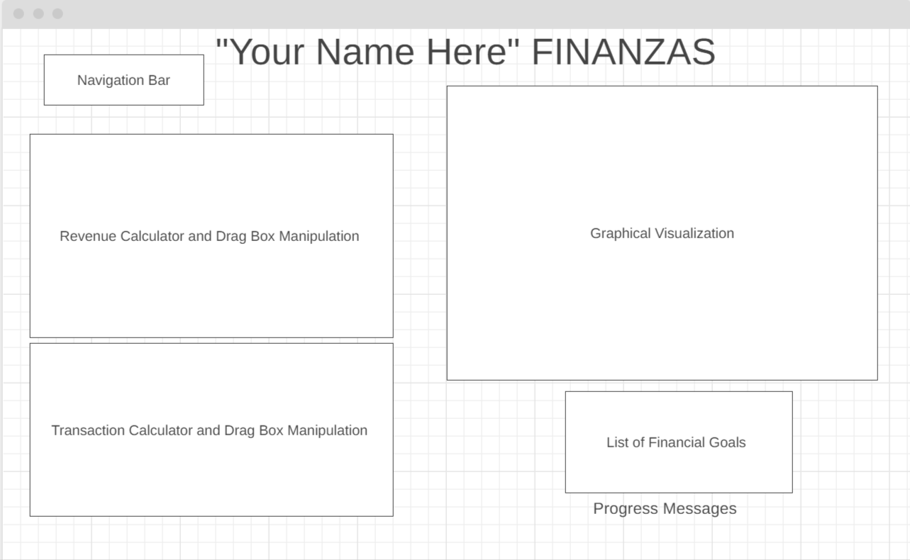

# Finanzas

## Background

Finanzas is an interactive budget visualization app that takes ancient budgeting to modernistic budgeting/financial goal setting. The app takes a user's income, savings, financial goals, and transactions to generate graphical projections on the accomplishment/failures of the goals considering user’s current location inflation rate. It creates an interactive experience with graphs and drags boxes that dynamically decrement or increment the balance. The graphs will change by color or size depending on the user's input.

## Functionality & MVPs
 In Finanzas, users are able to:

 - Input an optional amount of revenue streams and transactions with a calculator and drag box. 
 - The user can choose from a default drag box located at the bottom of the calculator or create their own with a chosen emoji and name. The user will be able to choose from a dropdown box the time frequency of each choice.
 - Create a list of financial goals on the digital notepad
 - Observe changes in the graph. The changes in the graph will be color coordinated based off of goals met, went over budget, under budget, a minimum time scale of 3 months and a maximum of 1 year, and inflation predictions over the course of time. 
 - Recieve live updates and encouragements about the progression on the app. 

In addition, this project will include:

- Instructions for how to work the app
- A production README
## Wireframes

## Technologies, Libraries, APIs

## Implementation Timeline

